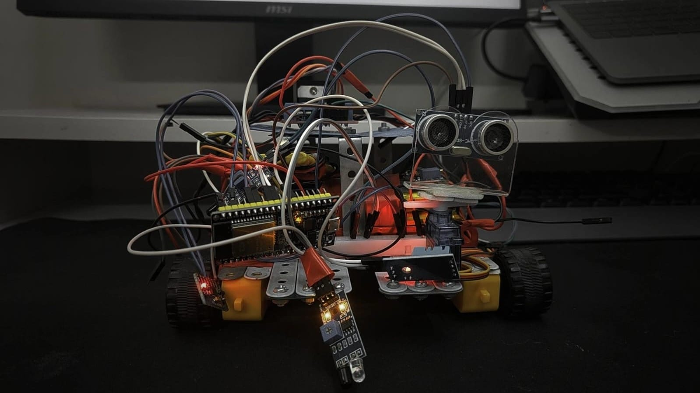
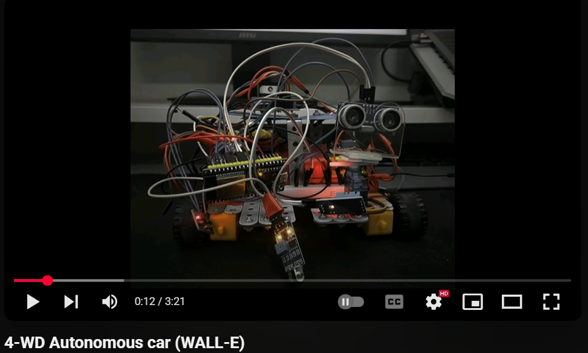

# 4WD Autonomous Car aka Wall-E


## Overview
 
This project consists of a WiFi-enabled, sensor-rich robotic vehicle, powered by an ESP32 microcontroller and controlled via a Python host application. The system supports both manual and autonomous operation, providing real-time environment sensing and smart obstacle avoidance within mapped room boundaries.

***

## Demo
[](https://youtu.be/gQyEAW1ap30?si=Ck5gOCbIng7AmUG1)

## Features

- **Manual and Autonomous Operation**: Switch between remote control (web interface) and autonomous navigation with intelligent safety checks.
- **Real-Time Web Dashboard**: View sensor readings, control movement, and toggle autonomous mode from any browser connected to the ESP32.

***
## Sensors \& Components

| Sensor/Module | Functionality | Pin(s) |
| :-- | :-- | :-- |
| Ultrasonic (HC-SR04 type) | Measures distance to obstacles | 5 (TRIG), 18 (ECHO) |
| IR Obstacle Sensor | Detects nearby objects | 34 |
| PIR Motion Sensor | Intruder detection | 35 |
| DHT11 | Temperature \& humidity | 4 |
| Flame Sensor | Fire detection | 32 |
| Adafruit MPU6050 | Accelerometer \& gyroscope for tilt, upside-down and movement detection | I2C (21,22) |
| Servo | Can move IR for scanning | 25 |
| Motors (4WD) | Direction \& driving control | 26,27,14,12 |


***
## Folder Structure

```
project_root/
├── robot_firmware/               # Folder for Arduino code (ESP32 .ino)
│   └── your_code.ino
├── room_mapper.py                # Python GUI for mapping room and obstacles
├── vehicle_controller.py         # Python script for autonomous/manual vehicle control
├── room_map.json                 # Saved by room_mapper.py (actual room and obstacles map)
```


***
## Flow of Use

### 1. **Map Your Room and Obstacles**

- Run `room_mapper.py` and interactively draw the room bounds and known obstacles.
- Save the map as `room_map.json`.


### 2. **Flash the ESP32**

- Upload the Arduino firmware (`.ino` file inside `robot_firmware/`) using the Arduino IDE.
- Connect all sensors and motors according to the pin assignments above.


### 3. **Start the System**

- Power on the vehicle and connect it to WiFi.
- Access the dashboard via your browser at `http://<esp32_ip>/` to view sensor data, send movement commands, and toggle autonomous mode.


### 4. **Run the Python Control System**

- On your PC (same network), run `vehicle_controller.py`.
- Set the ESP32 IP address variable in the Python file.
- Use commands (`start`, `stop`, `forward`, etc.) in the Python console.
- When autonomous mode is enabled, the vehicle moves, avoids mapped and real-time obstacles, stays within the room, and responds to all sensor events.
- Abnormal sensor readings (e.g., fire detection, extreme temperature/humidity, tilt, over-acceleration) trigger printed alerts and vehicle stops.


### 5. **Manual Override**

- On the web dashboard, use the buttons to control the car directly.
- When manual mode is toggled, Python autonomous control stops and the car only responds to web commands, allowing direct remote driving.

***
## Important Notes

- Firmware and Python scripts run independently; sensor data is refreshed via WiFi API.
- Always connect ESP32, PC, and vehicle to the same network.
- Room map must be updated in `room_map.json` whenever obstacles or bounds change.
- Safety is built in:
    - Automatic emergency stop on fire detection.
    - Tilt/upsidedown detection and alerts.
    - Motion/intruder alarms and abnormal environmental printouts.

***
## Troubleshooting

- If the car does not respond: check WiFi connection and ESP32 IP address.
- For sensor issues: ensure correct wiring and verify sensor health using dashboard data.
- Update map file (`room_map.json`) if your room layout changes.

***
## References

- Hardware: ESP32 board, DHT11, HC-SR04, PIR, IR, Flame sensor, MPU6050, Servo, 4WD motors.
- Inspired by guides and documentation for ESP32 robotics.

***

**This project combines robust hardware interfacing, real-time control, and customizable autonomous logic for a learner-friendly and powerful robotic car platform. Protect your workspace, test carefully, and enjoy building!**


